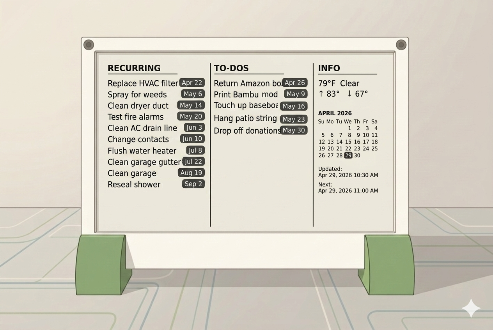

# eink-todoist

A small, always-on e-ink dashboard that renders my Todoist tasks on a Waveshare 7.5" display driven by a Raspberry Pi Zero 2 W.



## Inspiration

I live in Todoist — it's where my work, errands, and side projects all land. But pulling out my phone or opening a tab to check what's next adds just enough friction that I'd sometimes lose track of what I'd planned for the day.

I also have a 3D printer and a soft spot for hobby electronics. An e-ink panel felt like the right medium: paper-like, glanceable, no glow, and happy to sit on a shelf and update itself a few times an hour. Putting it together meant designing a printed enclosure, wiring up the Pi, and writing the code to tie my Todoist data to a layout that actually reads well on a 7.5" screen.

This repo is the code half of that project — a portfolio piece more than a product, but copy-friendly if you want to build your own.

## Hardware

- Raspberry Pi Zero 2 W
- Waveshare 7.5" e-Paper HAT (V2, 800x480)
- 3D-printed enclosure (designed for desk/shelf placement) — message me if you'd like the STLs

## How it works

- A Python script pulls tasks from the Todoist API
- Pillow renders a dashboard layout (overdue pills, today's list, a mini calendar)
- The image is pushed to the e-ink display on a 30-minute cadence with quiet hours overnight
- Before each push, the script computes a content signature. If nothing changed since the last push, the render and push are skipped entirely to reduce panel wear
- If the Todoist fetch fails, the script falls back to the most recently cached data and shows a stale-data notice on screen. If there is no cache yet, it renders a minimal error frame instead of crashing
- The footer shows when the display was last updated
- Runs as a systemd timer on the Pi (see `deploy/` for the unit files and install steps)

## What shows up on the display

The layout has three columns: RECURRING, TO-DOS, and INFO (weather, calendar, status).

Only tasks with due dates appear. The RECURRING column shows dated tasks from a dedicated Recurring Todoist project. The TO-DOS column shows all other dated, non-recurring tasks, sorted by date.

My Todoist triage tool assigns dates by priority: P1 lands today, P2 lands this week, P3 gets no date and never appears on the display.

Each column shows at most 10 rows. If there are more, a "+N more" line appears below the last row.

## Setup

```bash
git clone https://github.com/ericwagnergithub/eink-todoist.git
cd eink-todoist
pip install -r requirements.txt
```

Create a `.env` at the repo root with your configuration:

```bash
# Required
TODOIST_API_TOKEN=your_token_here
RECURRING_PROJECT_ID=1234567890123456

# Optional: weather in the INFO column (Open-Meteo, no key needed)
WEATHER_LAT=40.7128
WEATHER_LON=-74.0060
WEATHER_TZ=America/New_York   # defaults to "auto" if omitted

# Optional: path to the Waveshare e-Paper library (for --display mode)
# Default: /home/eric/projects/e-Paper/RaspberryPi_JetsonNano/python/lib
WAVESHARE_LIB_PATH=/path/to/e-Paper/RaspberryPi_JetsonNano/python/lib
```

For display-free iteration on any computer:

```bash
python scripts/dashboard.py --mock --png
```

This uses mock data, writes `out/dashboard.png`, and requires no Todoist token or Waveshare hardware.

## Systemd setup (Pi)

See `deploy/` for the service and timer units and a short install guide.

## Contact

If you want the enclosure STLs, have questions, or want to chat about the build, feel free to reach out.
